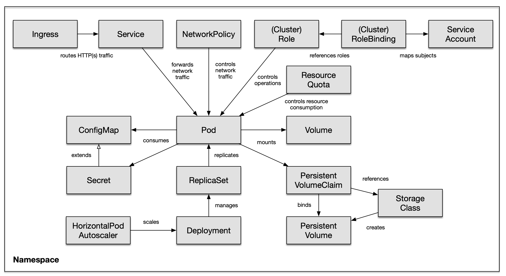
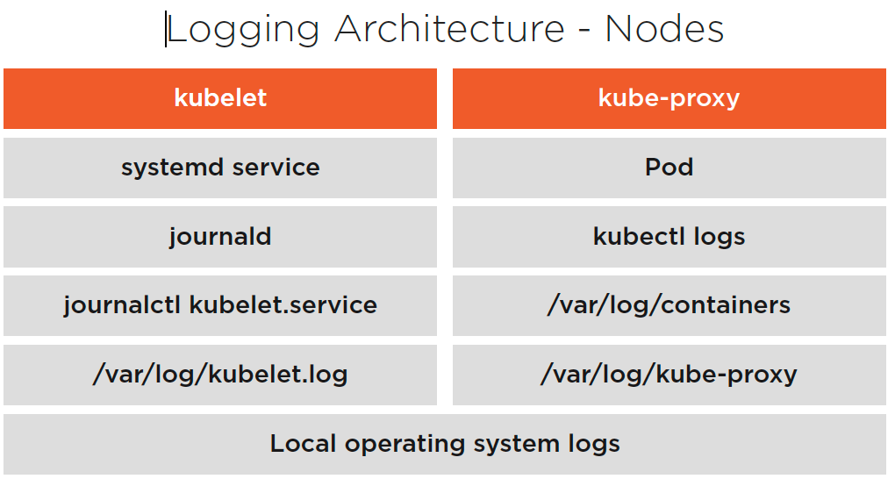
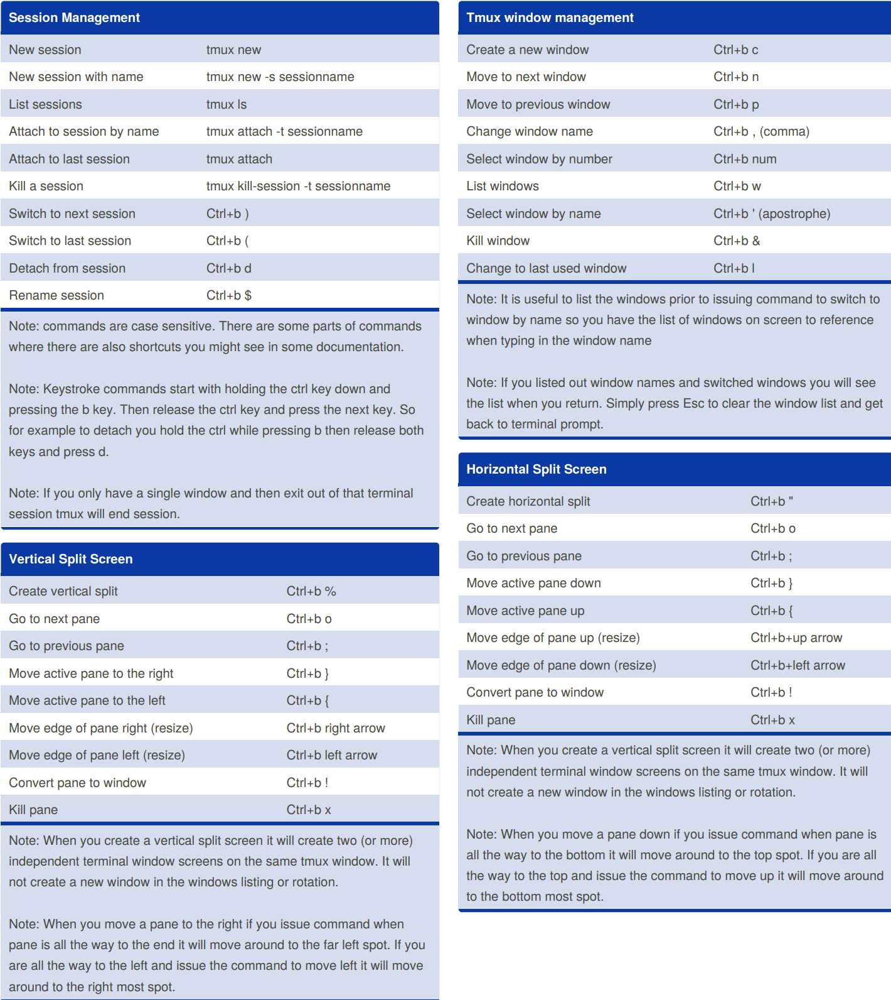

### default configuration files location:

```
kubelet configuration               =  /var/lib/kubelet/config.yaml
containerD configuration files      =  sudo vi /etc/containerd/config.toml
Default DATA dir for ETCD           =  /var/lib/etcd
path for containers LOG             = tail /var/log/containers/$CONTAINER_NAME_$CONTAINER_ID
SystemD UNIT configuration          = /etc/systemd/system/kubelet.service.d/10-kubeadm.conf
staticPodPath                       =  /etc/kubernetes/manifests
ServiceAccounts are mounted
    inside the POD as Volume        = /var/run/secrets/kubernetes.io/serviceaccount
Self-SIgned Certificate Authority   = /etc/kubernetes/pki/ca.key  --> PRIVATE KEY
                                    = /etc/kubernetes/pki/ca.crt  --> CA Certificate


Location for logs (not avail in KUBEADM clusters)
-------------------------------------------------
/var/log/kube-apiserver.log
/var/log/kube-scheduler.log
/var/log/kube-controller-manager.log


```



## below path where secrets associated with serviceAccounts are mounted:
```
cd /var/run/secrets/kubernetes.io/serviceaccount/
 |
 |--> token, ca.crt, namespace  
 
AFTER LOGIN INTO POD, use the CURL to authenticate with K8s API server.
 
 CA=/var/run/secrets/kubernetes.io/serviceaccount/ca.crt
 curl --cacert $CA -X GET https://kubernetes/api

other way is TOKEN:

TOKEN=$(cat /var/run/secrets/kubernetes.io/serviceaccount/token)
curl --cacert $CA -X GET https://kubernetes/api --header "Authorization: Bearer $TOKEN"
curl  -X GET https://kubernetes/api --header "Authorization: Bearer $TOKEN" --insecure

```


# VIM CHEATSHEET


```
:s/foo/bar/g
Find each occurrence of 'foo' (in the current line only), and replace it with 'bar'.
:%s/foo/bar/g
Find each occurrence of 'foo' (in all lines), and replace it with 'bar'.
:%s/foo/bar/gc
Change each 'foo' to 'bar', but ask for confirmation first.
:%s/\<foo\>/bar/gc
Change only whole words exactly matching 'foo' to 'bar'; ask for confirmation.
:%s/foo/bar/gci
Change each 'foo' (case insensitive due to the i flag) to 'bar'; ask for confirmation.
:%s/foo\c/bar/gc is the same because \c makes the search case insensitive.
This may be wanted after using :set noignorecase to make searches case sensitive (the default).

```

# TMUX


