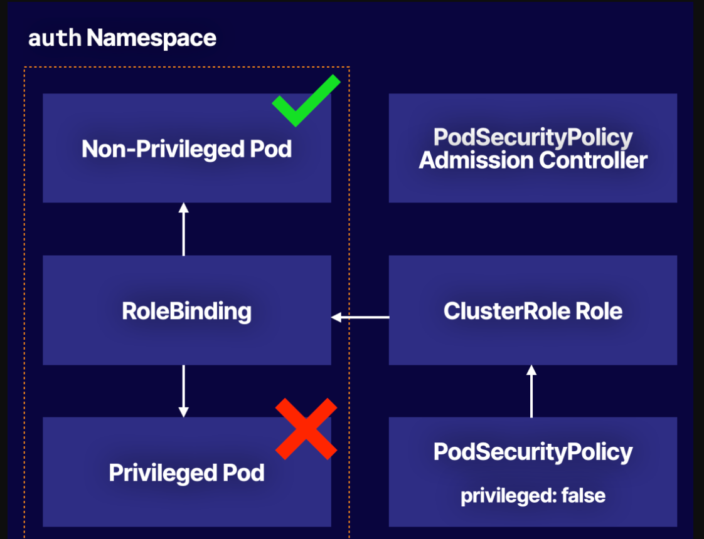

########################################################################  
#############    UPGRADE CLUSTER   ###################
######################################################################## 

### Upgrade All Kubernetes Components on the Control Plane Node
### Switch to the appropriate context with kubectl:
kubectl config use-context acgk8s
Upgrade kubeadm:

sudo apt-get update && \
sudo apt-get install -y --allow-change-held-packages kubeadm=1.22.2-00
Drain the control plane node:

kubectl drain acgk8s-control --ignore-daemonsets
Plan the upgrade:

sudo kubeadm upgrade plan v1.22.2
Apply the upgrade:

sudo kubeadm upgrade apply v1.22.2
Upgrade kubelet and kubectl:

sudo apt-get update && \
sudo apt-get install -y --allow-change-held-packages kubelet=1.22.2-00 kubectl=1.22.2-00
Reload:

sudo systemctl daemon-reload
Restart kubelet:

sudo systemctl restart kubelet
Uncordon the control plane node:

kubectl uncordon acgk8s-control
Upgrade All Kubernetes Components on the Worker Node
Drain the worker1 node:

kubectl drain acgk8s-worker1 --ignore-daemonsets --force
SSH into the node:

ssh acgk8s-worker1
Install a new version of kubeadm:

sudo apt-get update && \
sudo apt-get install -y --allow-change-held-packages kubeadm=1.22.2-00
Upgrade the node:

sudo kubeadm upgrade node
Upgrade kubelet and kubectl:

sudo apt-get update && \
sudo apt-get install -y --allow-change-held-packages kubelet=1.22.2-00 kubectl=1.22.2-00
Reload:

sudo systemctl daemon-reload
Restart kubelet:

sudo systemctl restart kubelet
Type exit to exit the node.

Uncordon the node:

kubectl uncordon acgk8s-worker1
Repeat the process above for acgk8s-worker2 to upgrade the other worker node.

########################################################################  
###  Back UP ETCD data & Restore    ###################
######################################################################## 

Back Up the etcd Data
From the terminal, log in to the etcd server:

ssh etcd1
Back up the etcd data:

ETCDCTL_API=3 etcdctl snapshot save /home/cloud_user/etcd_backup.db \
--endpoints=https://etcd1:2379 \
--cacert=/home/cloud_user/etcd-certs/etcd-ca.pem \
--cert=/home/cloud_user/etcd-certs/etcd-server.crt \
--key=/home/cloud_user/etcd-certs/etcd-server.key
Restore the etcd Data from the Backup
Stop etcd:

sudo systemctl stop etcd
Delete the existing etcd data:

sudo rm -rf /var/lib/etcd
Restore etcd data from a backup:

sudo ETCDCTL_API=3 etcdctl snapshot restore /home/cloud_user/etcd_backup.db \
--initial-cluster etcd-restore=https://etcd1:2380 \
--initial-advertise-peer-urls https://etcd1:2380 \
--name etcd-restore \
--data-dir /var/lib/etcd
Set database ownership:

sudo chown -R etcd:etcd /var/lib/etcd
Start etcd:

sudo systemctl start etcd
Verify the system is working:

ETCDCTL_API=3 etcdctl get cluster.name \
--endpoints=https://etcd1:2379 \
--cacert=/home/cloud_user/etcd-certs/etcd-ca.pem \
--cert=/home/cloud_user/etcd-certs/etcd-server.crt \
--key=/home/cloud_user/etcd-certs/etcd-server.key

########################################################################  
###  Drain Worker Node 1 ##############
Create a Pod That Will Only Be Scheduled on Nodes with a Specific Label
######################################################################## 

Attempt to drain the worker1 node:
kubectl drain acgk8s-worker1

Does the node drain successfully?
Override the errors and drain the node:

kubectl drain acgk8s-worker1 --delete-local-data --ignore-daemonsets --force
                        or
kubectl drain acgk8s-worker1 --ignore-daemonsets --delete-emptydir-data --force

kubectl label nodes acgk8s-worker2 disk=fast


kubectl get pod fast-nginx -n dev -o wide

########################################################################  
Create a PersistentVolume
Create a Pod That Uses the PersistentVolume for Storage
Expand the PersistentVolumeClaim
######################################################################## 


########################################################################  
###       CIS Kubernetes Benchmark 
########################################################################  
Run kube-bench and Obtain a CIS Benchmark Report
Download the kube-bench Job manifest files:

        wget -O kube-bench-control-plane.yaml https://raw.githubusercontent.com/aquasecurity/kube-bench/main/job-master.yaml        
        wget -O kube-bench-node.yaml https://raw.githubusercontent.com/aquasecurity/kube-bench/main/job-node.yaml
Create the Jobs to run the benchmark files:

        kubectl create -f kube-bench-control-plane.yaml
        kubectl create -f kube-bench-node.yaml
Check the status of the Jobs:

        kubectl get pods
Save the benchmark results on the Jobs Pod logs, replacing the Pod name placeholder values with the actual Pod names:

        kubectl logs <CONTROL_PLANE_JOB_POD_NAME> > /home/cloud_user/kube-bench-control.log
        kubectl logs <NODE_JOB_POD_NAME> > /home/cloud_user/kube-bench-worker.log
Turn Off Profiling for the API Server, Controller Manager, and Scheduler
View the kube-bench test results for the control plane:

        cat /home/cloud_user/kube-bench-control.log
Scroll down to the failed test 1.2.20 and read the summary.

Scroll down to the Remediations master near the bottom and read under 1.2.20 for additional information on fixing the issue.
Scroll to 1.3.2 and 1.4.1 and read the information on fixing these issues.
Edit the Kubernetes API server manifest file using the provided lab password:

sudo vi /etc/kubernetes/manifests/kube-apiserver.yaml
Under containers:, add the following command beneath kube-apiserver to turn off profiling:

        spec:
          containers:
          - command:
            - kube-apiserver
            - --profiling=false

    ...
To save and exit the file, press Escape and enter :wq.

Repeat the process above to turn off profiling for the Kubernetes controller manager:

        spec:
          containers:
          - command:
            - kube-controller-manager
            - --profiling=false

    ...
Repeat the process again to turn off profiling for the Kubernetes scheduler:

        spec:
          containers:
          - command:
            - kube-scheduler
            - --profiling=false

    ...
Check the Pods:

        kubectl get pods -n kube-system
Set kubelet authn/authz to Use Webhook Mode
View the kube-bench test results for the worker node:

        cat /home/cloud_user/kube-bench-worker.log
Scroll down to the failed test 4.2.2 and read the summary.

Scroll down to the Remediations node near the bottom and read under 4.2.2 for additional information on fixing the issue.
Log in to the worker node server using the provided lab credentials:

ssh cloud_user@<PUBLIC_IP_ADDRESS>
Edit the kubelet configuration file using the provided lab password:

sudo vi /var/lib/kubelet/config.yaml
Set authorization.mode to Webhook:

authorization:
  mode: Webhook
Press Escape and enter :wq.

Restart kubelet:

        sudo systemctl restart kubelet
To verify the issues were fixed, return to the control plane server and delete the existing Jobs:

        kubectl delete job kube-bench-master
        kubectl delete job kube-bench-node
Re-run the Jobs:

        kubectl create -f kube-bench-control-plane.yaml
        kubectl create -f kube-bench-node.yaml
Check the Pods:

        kubectl get pods
Once the STATUS shows Completed, view the Pod logs, replacing the Pod name placeholder values with the actual Pod names:

        kubectl logs <CONTROL_PLANE_JOB_POD_NAME>
        kubectl logs <NODE_JOB_POD_NAME>
Check the results of the kube-bench tests. For the tests addressed, the results should now show [PASS]!

########################################################################  
###       Checing the BINARIES and CHECKSUM 
########################################################################  
VERSION=$(cat version.txt)

curl -LO "https://dl.k8s.io/$VERSION/bin/linux/amd64/kubectl.sha256"
curl -LO "https://dl.k8s.io/$VERSION/bin/linux/amd64/kubelet.sha256"
curl -LO "https://dl.k8s.io/$VERSION/bin/linux/amd64/kube-apiserver.sha256"

echo "$(<kubectl.sha256) kubectl" | sha256sum --check
echo "$(<kubelet.sha256) kubelet" | sha256sum --check
echo "$(<kube-apiserver.sha256) kube-apiserver" | sha256sum --check

########################################################################  
###   Protect a Kubernetes Cluster with AppArmor    
########################################################################

sample AppArmor policy file to deny writes onto DISK.
```
#include <tunables/global>
profile k8s-deny-write flags=(attach_disconnected) {
  #include <abstractions/base>
  file,
  # Deny all file writes.
  deny /** w,
}
```

```
apiVersion: v1
kind: Pod
metadata:
  name: password-db
  namespace: auth
  annotations:
    container.apparmor.security.beta.kubernetes.io/password-db: localhost/k8s-deny-write
spec:
  containers:
  - name: password-db
    image: radial/busyboxplus:curl
    command: ['sh', '-c', 'while true; do if echo "The password is hunter2" > password.txt; then echo "Password hunter2 logged."; else echo "Password log attempt blocked."; fi; sleep 5; done']
```
using APPArmor.

```
sudo apparmor_parser apparmor-k8s-deny-write

sudo cp apparmor-k8s-deny-write /etc/apparmor.d

sudo chown root:root /etc/apparmor.d/apparmor-k8s-deny-write
```
kubectl exec password-db -n auth -- cat password.txt


########################################################################  
###   POD SECURITY POLICIES
########################################################################

[](images/psp.png)


sudo vi /etc/kubernetes/manifests/kube-apiserver.yaml


add this  --enable-admission-plugins=NodeRestriction,PodSecurityPolicy


```
vim psp-no-privileged.yml

apiVersion: policy/v1beta1
kind: PodSecurityPolicy
metadata:
  name: psp-no-privileged
spec:
  privileged: false
  runAsUser:
    rule: RunAsAny
  fsGroup:
    rule: RunAsAny
  seLinux:
    rule: RunAsAny
  supplementalGroups:
    rule: RunAsAny
  volumes:
  - configMap
  - downwardAPI
  - emptyDir
  - persistentVolumeClaim
  - secret
  - projected

```
Create an RBAC Setup to Apply the PodSecurityPolicy in the auth Namespace

```
vim cr-use-psp-no-privileged.yml

apiVersion: rbac.authorization.k8s.io/v1
kind: ClusterRole
metadata:
  name: cr-use-psp-no-privileged
rules:
- apiGroups: ['policy']
  resources: ['podsecuritypolicies']
  verbs:     ['use']
  resourceNames:
  - psp-no-privileged

--------

vim rb-auth-sa-psp.yml


apiVersion: rbac.authorization.k8s.io/v1
kind: RoleBinding
metadata:
  name: rb-auth-sa-psp
  namespace: auth
roleRef:
  kind: ClusterRole
  name: cr-use-psp-no-privileged
  apiGroup: rbac.authorization.k8s.io
subjects:
- kind: ServiceAccount
  name: auth-sa
  namespace: auth

------
PRIVILEGED POD


apiVersion: v1
kind: Pod
metadata:
  name: privileged-pod
  namespace: auth
spec:
  serviceAccount: auth-sa
  containers:
  - name: background-monitor
    image: radial/busyboxplus:curl
    command: ['sh', '-c', 'while true; do echo "Running..."; sleep 5; done']
    securityContext:
      privileged: true


-----
NON PRIVILEGED POD

apiVersion: v1
kind: Pod
metadata:
  name: non-privileged-pod
  namespace: auth
spec:
  serviceAccount: auth-sa
  containers:
  - name: background-monitor
    image: radial/busyboxplus:curl
    command: ['sh', '-c', 'while true; do echo "Running..."; sleep 5; done']

```

########################################################################  
###   Manage Sensitive Config Data with Kubernetes Secrets
########################################################################
